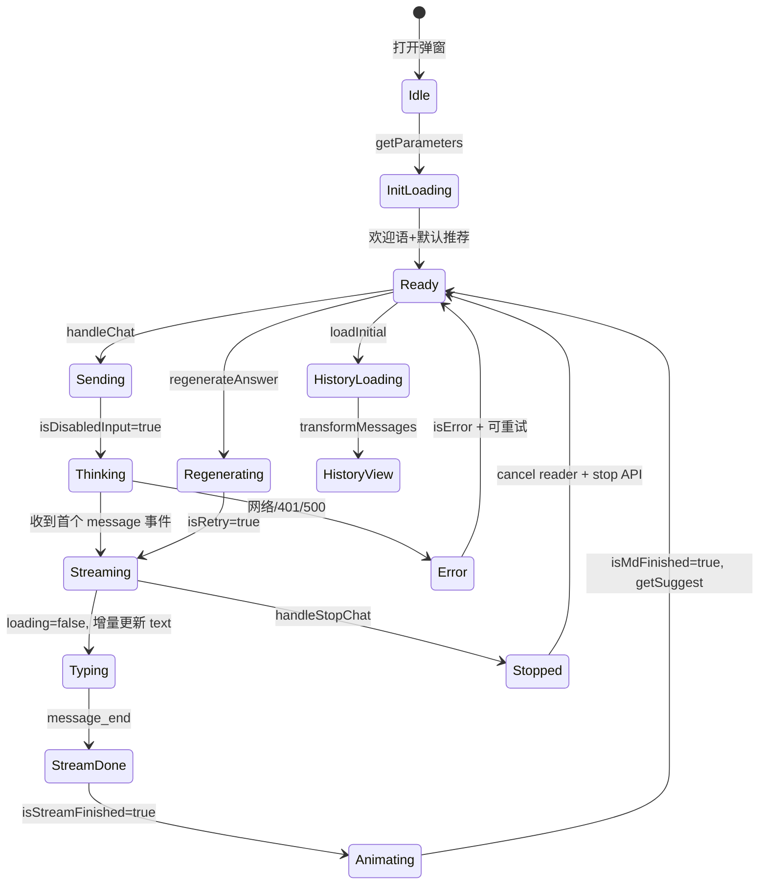

下面是根据当前项目代码整理的完整实现文档。你截图里的 EventStream 就是 **SSE（Server-Sent Events）** 流式响应；项目里核心逻辑在 `BConversation.vue`，打字机在 `BMarkdown.vue`，建议在 `BSuggestion.vue`。

---

# AI 智能问答功能 — 从零到一实现指南

## 目录

1. [整体架构](#1-整体架构)
2. [什么是 EventStream（SSE）](#2-什么是-eventstreamsse)
3. [接口清单](#3-接口清单)
4. [核心数据结构](#4-核心数据结构)
5. [接口调用（流式对话）](#5-接口调用流式对话)
6. [打字机效果](#6-打字机效果)
7. [加载中输入框禁用](#7-加载中输入框禁用)
8. [历史会话](#8-历史会话)
9. [「您可能想了解」与「换一换」](#9-您可能想了解与换一换)
10. [重新生成](#10-重新生成)
11. [完整状态机](#11-完整状态机)
12. [从零实现步骤清单](#12-从零实现步骤清单)

---

## 1. 整体架构

```
┌─────────────────────────────────────────────────────────┐
│  BAIAssistantModal/index.vue  （弹窗壳）                  │
│    └── BConversation.vue      （核心业务：对话+输入+历史）  │
│          ├── BMessage.vue     （单条消息渲染）             │
│          │     └── BMarkdown.vue （Markdown + 打字机）    │
│          └── BSuggestion.vue  （推荐问题 + 换一换）        │
└─────────────────────────────────────────────────────────┘
         │
         ▼
  src/request/ai-assistant.ts  （REST 接口封装）
         │
         ▼
  /api-ai/v1/*  （后端 AI 服务，兼容 Dify 风格 SSE）
```

**关键设计决策：**

- 流式对话用 **原生 `fetch` + `ReadableStream`**，不用 axios（便于 AbortController 中止、手动解析 SSE）
- 打字机分 **两层**：SSE 增量追加文本 → Markdown 逐字渲染
- 登录用户才有历史会话；未登录用随机 `user_xxx` 作为 userId

---

## 2. 什么是 EventStream（SSE）

### 2.1 概念

**EventStream** 是 Chrome DevTools 对 **SSE（Server-Sent Events）** 响应的可视化标签。当接口返回 `Content-Type: text/event-stream` 时，Network 面板会显示 **EventStream** 而不是普通 Response。

SSE 是一种 **服务端单向推送** 协议：服务端持续向客户端发送事件，客户端用流式读取逐块处理。

### 2.2 数据格式

每条 SSE 消息格式：

```
data: {"event":"message","answer":"您好","conversationId":"xxx","messageId":"yyy","taskId":"zzz"}\n\n
```

- 以 `data: ` 开头
- 一条 JSON
- 以 `\n\n` 结尾（双换行分隔）

你截图中的 Data 列就是每个 `data:` 块里的 JSON，`answer` 字段是增量文本片段。

### 2.3 与 Response 的区别

| 对比项 | 普通 JSON Response | EventStream (SSE) |
|--------|-------------------|-------------------|
| Content-Type | `application/json` | `text/event-stream` |
| 数据到达 | 一次性完整返回 | 分块实时推送 |
| 前端读取 | `response.json()` 等完整 body | `response.body.getReader()` 循环读 |
| 用户体验 | 等待后整段显示 | 边生成边显示（打字机） |
| DevTools | Response 标签看完整 JSON | EventStream 标签看每条事件 |
| 适用场景 | CRUD、查询 | AI 对话、实时通知、进度推送 |

### 2.4 本项目中的 SSE 事件类型

代码在 `chatAi` 中解析 `parsedData.event`：

| event | 含义 | 前端动作 |
|-------|------|----------|
| `message` | 内容增量 | `answerValue += parsedData.answer`，更新 UI |
| `message_end` | 流结束 | 保存分支、拉取推荐问题 |
| `error` | 错误 | 标记失败、恢复输入 |
| `ping`（Dify） | 心跳 | 过滤掉，不参与解析 |

---

## 3. 接口清单

所有接口前缀：`/api-ai`，定义在 `src/request/ai-assistant.ts`。

| 接口 | 方法 | 用途 |
|------|------|------|
| `/v1/parameters` | GET | 欢迎语、默认推荐问题 |
| `/v1/chat-messages` | POST | 发送消息（SSE 流式） |
| `/v1/chat-messages/{taskId}/stop` | POST | 停止生成 |
| `/v1/conversations` | GET | 获取会话列表（取 conversationId） |
| `/v1/messages` | GET | 获取历史消息 |
| `/v1/messages/{messageId}/suggested` | GET | 获取「您可能想了解」 |

**公共请求头：**

```typescript
{
  'Content-Type': 'application/json',
  Authorization: 'Bearer ' + token,  // 登录时
  userId: userId,
  tenantId: tenantId,
  Accept: 'text/event-stream',       // 仅流式对话需要
}
```

---

## 4. 核心数据结构

```typescript
// src/interfaces/type.ts
interface ChatStateItem {
  id: string;
  type: number;           // 0=用户, 1=机器人
  text: string;
  isMdFinished?: boolean; // 打字机动画是否完成
  isRegenerate?: boolean; // 重新生成 loading
  branches?: { id: string; text: string }[];  // 多版本回答
  currentBranchId?: string;
  isError?: boolean;
  forceShowSuggestion?: boolean;
  suggestionList?: string[];
  time?: number;
  isBatchEnd?: boolean;   // 历史消息批次分隔
  isSystem?: boolean;
}

// 运行时状态
const cloudState = {
  messageId: '',
  taskId: '',
  conversationId: '',
  parentMessageId: '',  // 重新生成时关联父消息
};
```

---

## 5. 接口调用（流式对话）

### 5.1 请求体

```typescript
POST /api-ai/v1/chat-messages

{
  "inputs": {
    "companyId": "...",
    "authorization": "Bearer ...",
    "domain": "https://...",
    "isTemplateReply": "0",
    "platformType": 1
  },
  "query": "用户问题",
  "response_mode": "streaming",   // 关键：开启 SSE
  "conversation_id": "已有会话ID或空",
  "user": "userId",
  "parentMessageId": "重新生成时传入",
  "files": []
}
```

### 5.2 流式读取核心代码（简化版）

```typescript
const chatAi = async (content, onMessageReceived, end, isRetry = false) => {
  const response = await fetch('/api-ai/v1/chat-messages', {
    method: 'POST',
    signal: controller.signal,
    headers: {
      'Content-Type': 'application/json',
      Accept: 'text/event-stream',
      userId: userId.value,
      Authorization: token ? `Bearer ${token}` : '',
    },
    body: JSON.stringify({
      query: content,
      response_mode: 'streaming',
      conversation_id: conversationId.value,
      user: userId.value,
      parentMessageId: cloudState.parentMessageId || undefined,
      inputs: { /* ... */ },
    }),
  });

  // 错误响应可能是 JSON 而非 SSE
  const contentType = response.headers.get('content-type') || '';
  if (contentType.includes('application/json')) {
    const json = await response.clone().json();
    if (json.code !== 0) { /* 错误处理 */ return; }
  }

  const reader = response.body!.getReader();
  const decoder = new TextDecoder();
  let buffer = '';

  while (true) {
    const { value, done } = await reader.read();
    if (done) break;

    buffer += decoder.decode(value, { stream: true });
    buffer = buffer.replace(/{"event":"ping"}\n?/g, ''); // 过滤心跳

    let boundaryIndex;
    while ((boundaryIndex = buffer.indexOf('\n\n')) !== -1) {
      const message = buffer.slice(0, boundaryIndex).trim();
      buffer = buffer.slice(boundaryIndex + 2);

      if (message.startsWith('data: ')) {
        const parsed = JSON.parse(message.slice(6));

        // 保存会话元数据
        cloudState.taskId = parsed.taskId || cloudState.taskId;
        conversationId.value = parsed.conversationId || conversationId.value;
        cloudState.messageId = parsed.messageId || cloudState.messageId;

        if (parsed.event === 'message') {
          onMessageReceived(parsed.answer);  // 增量文本
        }
        if (parsed.event === 'message_end') {
          end();
          return;
        }
        if (parsed.event === 'error') {
          /* 错误处理 */ return;
        }
      }
    }
  }
};
```

### 5.3 发送消息的完整流程

```typescript
const handleChat = async (content: string) => {
  if (!content.trim() || isDisabledInput.value) return;

  isDisabledInput.value = true;
  aiInfo.suggestionList = [];

  // 1. 插入用户消息
  chatList.push({ type: USER, text: content });

  // 2. 发起流式请求
  let answerValue = '';
  const robotIndex = chatList.length; // 占位

  chatAi(
    content,
    (chunk) => {
      answerValue += chunk;
      chatList[robotIndex] = { type: ROBOT, text: answerValue, isMdFinished: false };
    },
    () => {
      // 流结束：保存第一个分支
      chatList[robotIndex].branches = [{ id: '1', text: answerValue }];
      chatList[robotIndex].currentBranchId = '1';
      isStreamFinished.value = true;
      getSuggest(); // 拉推荐问题
    }
  );
};
```

---

## 6. 打字机效果

打字机是 **SSE 流式 + 前端动画** 两层叠加。

### 6.1 第一层：SSE 增量更新（真实数据流）

```typescript
// BConversation.vue - onMessageReceived 回调
(res: string) => {
  answerValue.value += res;  // 每次 SSE chunk 追加
  chatList[assistantMessageIndex].text = answerValue.value;
}
```

Network EventStream 里每条 `answer:"您好"`、`answer:"!"` 都会触发 UI 更新。

### 6.2 第二层：BMarkdown 逐字渲染（视觉动画）

```typescript
// BMarkdown.vue 核心逻辑
const typeNextChar = () => {
  if (index.value < textBuffer.value.length) {
    index.value++;
    renderedHtml.value = md.render(textBuffer.value.slice(0, index.value));
    setTimeout(typeNextChar, 20);  // 每 20ms 多显示一个字符
  } else {
    isTypingDone.value = true;
    maybeFinish();  // 打字完成 + 流结束 → emit finished
  }
};

watch(() => props.content, (newVal) => {
  textBuffer.value = newVal;
  if (!typingTimeout.value) typeNextChar();  // 有新内容就续打
});
```

### 6.3 完成条件（两个都要满足）

```typescript
const maybeFinish = () => {
  if (isTypingDone.value && isStreamFinished.value) {
    emit('update:finished', true);  // → item.isMdFinished = true
  }
};
```

- `isStreamFinished`：SSE `message_end` 到达
- `isTypingDone`：当前 buffer 字符打完
- `lastRobotFinished`：最后一条机器人消息的 `isMdFinished`

历史消息加载时关闭打字机：`:typewriter="!item?.forceShowSuggestion"`。

---

## 7. 加载中输入框禁用

### 7.1 状态变量

| 变量 | 含义 |
|------|------|
| `isDisabledInput` | 发送后到请求结束，禁止再次发送 |
| `loading` | 首条 SSE 到达前，「正在思考中...」 |
| `retryLoading` | 重新生成时的 loading |
| `lastRobotFinished` | 最后一条机器人打字机动画是否完成 |
| `isStopChat` | 用户点击停止 |

### 7.2 输入框禁用条件

```vue
<a-textarea
  :disabled="isDisabledInput || !(!isStopChat && lastRobotFinished)"
/>
```

等价于：**正在回答 / 打字机动画未结束 / 停止中** 时不可输入。

### 7.3 底部按钮三态

```vue
<!-- 可发送 -->


<!-- 思考中（不可停止） -->
<LoadingOutlined v-else-if="retryLoading || loading" />

<!-- 生成中（可停止） -->
<span v-else @click="handleStopChat" />  <!-- 停止按钮 -->
```

### 7.4 状态流转

```
用户发送
  → isDisabledInput = true
  → loading = true（显示「正在思考中...」）
  → 收到第一个 SSE message chunk
  → loading = false（开始显示内容）
  → SSE message_end
  → isStreamFinished = true
  → BMarkdown 打字完成
  → isMdFinished = true → lastRobotFinished = true
  → finally: isDisabledInput = false
```

### 7.5 重复发送拦截

```typescript
if (isDisabledInput.value) {
  errorMsg('请等待当前问题回答完成后再继续提问');
  return;
}
```

---

## 8. 历史会话

### 8.1 前置条件

- 用户已登录（`getAccessToken()`）
- 挂载时 `getConversations` 取最近 `conversationId`

### 8.2 加载流程

```
点击「点击查看历史会话」
  → loadInitial()
  → handleStopChat() 停止当前对话
  → fetchMessages(page=1)  GET /v1/messages
  → transformMessagesWithBranches() 转换数据结构
  → 渲染 historyList
  → 上滑 scrollTop < 10 → loadMore() 分页加载更早消息
```

### 8.3 历史消息接口

```typescript
GET /api-ai/v1/messages?user=xxx&conversationId=xxx&limit=20
// 返回: { data: Message[], hasMore: boolean }
```

### 8.4 分支结构转换

历史消息含 `parentMessageId`，表示「重新生成」产生的分支：

```typescript
// transformMessagesWithBranches 逻辑
// parentMessageId 存在 → 挂到父消息的 branches[]
// 无 parentMessageId → 独立问答对（query + answer）
```

### 8.5 滚动位置保持

加载更早历史时 prepend 到列表顶部，通过 `scrollTop = newHeight - oldHeight` 避免跳动。

---

## 9. 「您可能想了解」与「换一换」

### 9.1 数据来源

| 时机 | 来源 |
|------|------|
| 初次打开 | `GET /v1/parameters` → `suggestedQuestions` 取前 3 条 |
| 每次 AI 回答结束 | `GET /v1/messages/{messageId}/suggested` |
| 接口为空 | 从 `defaultSuggestions` 随机抽 3 条兜底 |

### 9.2 显示条件

```vue
<BSuggestion
  v-if="aiInfo.suggestionList?.length && lastRobotFinished && !isDisabledInput && !lastItemError"
  :total="lastRobotBranches"
  @onChange="getSuggest(true)"
  @onChat="handleChat"
/>
```

### 9.3 标题逻辑（BSuggestion.vue）

```vue
<span>{{ total && total > 1 ? '继续追问' : '您可能想了解' }}</span>
```

- `total > 1`：有多个重新生成分支 → 显示「继续追问」
- 否则 → 「您可能想了解」

### 9.4 「换一换」

```typescript
const getSuggest = async (isChange = false) => {
  if (!isChange) aiInfo.suggestionList = [];  // 非换一换时先清空
  aiInfo.suggestionLoading = true;

  let list = await getMessageSuggested({ user, messageId });
  if (!list.length) list = await fetchSuggest();  // 空则再请求一次
  if (!list.length) list = getRandomItems(defaultSuggestions, 3);  // 兜底

  aiInfo.suggestionList = list;
};
```

`isChange = true` 时保留旧列表，仅 loading 遮罩，避免闪烁。

### 9.5 隐藏「换一换」

当 `total === IS_NOT_SHOW_CHANGE (-1)` 时不显示换一换按钮（当前主流程里 `total` 实际是分支数）。

---

## 10. 重新生成

### 10.1 触发

最后一条机器人消息下方「重新生成」→ `regenerateAnswer(item)`。

### 10.2 流程

```typescript
const regenerateAnswer = (item) => {
  const prevUserMessage = chatList[chatList.length - 2];

  item.text = '';
  item.isMdFinished = false;
  isStreamFinished.value = false;

  chatAi(
    prevUserMessage.text,           // 重发同一问题
    (chunk) => { /* 追加到新分支 */ },
    () => {
      branchCounter++;
      item.branches.push({ id: branchCounter, text: answerValue });
      item.currentBranchId = branchCounter;
      getSuggest();
    },
    true,   // isRetry = true
    item,
  );
};
```

### 10.3 isRetry 与普通发送的区别

| 行为 | 普通发送 | 重新生成 (isRetry) |
|------|----------|-------------------|
| 插入用户消息 | 是 | 否 |
| 插入机器人占位 | 是 | 否（复用现有） |
| loading 变量 | `loading` | `retryLoading` |
| 请求 parentMessageId | 清空 | 保留 cloudState |
| 完成后 | 新建 branches[0] | branches.push 新分支 |

### 10.4 分支切换

多条回答时显示 `< 1/3 >` 分页，调用 `prevBranch` / `nextBranch` 切换 `currentBranchId` 和 `text`。

---

## 11. 完整状态机



---

## 12. 从零实现步骤清单

### Phase 1：基础对话

- [ ] 封装 `ai-assistant.ts` 各 REST 接口
- [ ] 实现 `chatAi`：`fetch` + SSE 解析 + AbortController
- [ ] 实现 `handleChat`：用户消息入列 + 机器人占位 + 增量更新
- [ ] 实现 `BMessage` 基础渲染（用户/机器人气泡）

### Phase 2：流式体验

- [ ] 集成 `markdown-it` 做 `BMarkdown`
- [ ] 实现逐字打字机（`typeNextChar` + `streamFinished` 双条件完成）
- [ ] 输入框禁用 + 发送/Loading/停止 三态按钮
- [ ] 「正在思考中...」占位（首 chunk 前）

### Phase 3：推荐问题

- [ ] 初始化 `getParameters` 拉欢迎语和默认问题
- [ ] 回答结束后 `getMessageSuggested`
- [ ] `BSuggestion` 组件 + 点击发送 + 换一换

### Phase 4：高级功能

- [ ] `regenerateAnswer` + branches 分支管理 + 分页切换
- [ ] `handleStopChat`：cancel reader + stop API
- [ ] 错误重试（用户消息 `isError` + 点击重试）

### Phase 5：历史会话

- [ ] 登录态 `getConversations` 取 conversationId
- [ ] `loadInitial` + `fetchMessages` + `transformMessagesWithBranches`
- [ ] 上滑分页 `loadMore` + 滚动位置保持
- [ ] 历史消息关闭打字机（直接渲染全文）

### Phase 6：体验优化

- [ ] `vue-stick-to-bottom` 自动滚底
- [ ] ResizeObserver 监听内容高度
- [ ] 401 跳转登录、500 友好提示
- [ ] 过滤 SSE ping 心跳

---

## 附录：关键文件索引

| 文件 | 职责 |
|------|------|
| `src/request/ai-assistant.ts` | 全部 AI 接口定义 |
| `src/components/business/BAIAssistantModal/components/BConversation.vue` | 对话主逻辑（~1800 行） |
| `src/components/business/BAIAssistantModal/components/BMarkdown.vue` | Markdown + 打字机动画 |
| `src/components/business/BAIAssistantModal/components/BMessage.vue` | 单条消息组件 |
| `src/components/business/BAIAssistantModal/components/BSuggestion.vue` | 推荐问题 UI |
| `src/interfaces/type.ts` | `ChatStateItem` 类型定义 |

---

## 附录：最小可运行 SSE 解析示例

若要从零验证 SSE，可用下面独立脚本：

```typescript
async function streamChat(query: string) {
  const res = await fetch('/api-ai/v1/chat-messages', {
    method: 'POST',
    headers: {
      'Content-Type': 'application/json',
      Accept: 'text/event-stream',
      userId: 'user_test',
    },
    body: JSON.stringify({
      query,
      response_mode: 'streaming',
      user: 'user_test',
      inputs: {},
    }),
  });

  const reader = res.body!.getReader();
  const decoder = new TextDecoder();
  let buffer = '';
  let fullText = '';

  while (true) {
    const { done, value } = await reader.read();
    if (done) break;

    buffer += decoder.decode(value, { stream: true });
    let idx;
    while ((idx = buffer.indexOf('\n\n')) !== -1) {
      const line = buffer.slice(0, idx).trim();
      buffer = buffer.slice(idx + 2);
      if (line.startsWith('data: ')) {
        const data = JSON.parse(line.slice(6));
        if (data.event === 'message') {
          fullText += data.answer;
          console.log('增量:', data.answer, '| 累计:', fullText);
        }
      }
    }
  }
  return fullText;
}
```